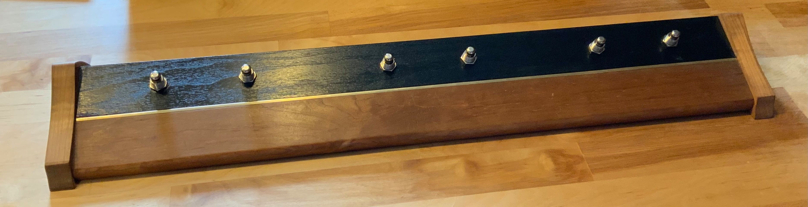

This is a simple USB computer keyboard footswitch.

you can build it in whatever enclosure you like and use as many switches as your board will support.

could be used with other boards besides the Teensy LC i used. they must support "USB keyboard"

BOM: Teensy or similar, (if you have one with dead ADCs or vref you can still use it)
Foot switches (i used guitar pedal "stomp switches" from small bear electronics http://smallbear-electronics.mybigcommerce.com/momentary-spst-no-soft-touch/) 
wire (solid core is nice, i ripped some out of cat5 cable)
USB cable
optional USB passthrough or bulkhead cable.

list of boards that work:
Teensy (LC,3.0,3.1,3.2,3.5,3.6,4.0,4.1)
arduino Leonardo, Esplora, Zero, Due and MKR Family

possibly:
AVR arduinos with LUFA http://www.fourwalledcubicle.com/LUFA.php

I used "normally on" switches, if you have "normally on" you will have to edit code a bit, it is explained in the code

IF you are a cross platform computer programmer, and want to help make something cool, let me know!
my idea is to have a taskbar type program that monitors which window is focused on the computer and if the program is in the configuration, tell the keyfoot which keys should do what via USB serial.

